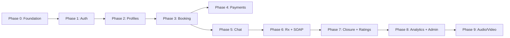

# Development Roadmap

Phased plan for the Hospital Tele-Consulting Platform monorepo.

## Architecture

| App / package | Role |
|---------------|------|
| `apps/patient-mobile` | Patient module (React Native / Expo) |
| `apps/doctor-admin` | Doctor module + admin tooling (Next.js) |
| `apps/backend` | Node.js orchestration (payments, PDFs, emails) |
| `packages/shared-types` | Shared TypeScript types and API contracts |
| `supabase/` | Database, auth, storage, realtime, migrations |

## Guiding principles

| Principle | Rationale |
|-----------|-----------|
| Foundation first | Schema, auth, and RLS unblock every module |
| Vertical slices | Ship end-to-end flows (book → chat → close) before edge cases |
| Supabase for data + realtime | Auth, Postgres, Storage, Realtime, RLS |
| Node.js for orchestration | Payments, PDFs, emails, complex business rules |
| Shared types early | `@teleconsult/shared-types` grows with each phase |
| Audio/video last | Phase 9 only — not a current priority |

---

## Phase 0 — Monorepo & platform foundation

**Priority: P0 | All modules**

| Area | Features |
|------|----------|
| Monorepo | Turborepo pipelines, env conventions, shared ESLint/TS config |
| Supabase | Core schema migrations, RLS policies, Storage buckets, audit log table |
| Shared package | Expand `UserRole`, entities, API contracts in `shared-types` |
| Backend scaffold | Node.js service skeleton, Supabase service role client |
| Apps scaffold | Init Next.js `doctor-admin`; wire Supabase clients in both apps |

**Exit criteria:** All three apps run locally; a test user can authenticate against Supabase.

---

## Phase 1 — Authentication, sessions & roles

**Priority: P0 | Shared behaviours**

| Feature | Patient | Doctor | Backend / Supabase |
|---------|---------|--------|-------------------|
| Email/password login | ✓ | ✓ | Supabase Auth |
| 30-min inactivity timeout | ✓ | ✓ | Session refresh + client guard |
| Role-based access (patient / doctor / admin) | ✓ | ✓ | RLS + JWT claims |
| B2C self-registration + email verification | ✓ | — | Supabase Auth |
| B2B admin-managed accounts (one-time setup link) | ✓ | ✓ | Admin API + invite flow |
| Encrypted in transit | ✓ | ✓ | HTTPS/TLS |

**Exit criteria:** Patient and doctor can log in with correct role isolation; admin can invite users.

---

## Phase 2 — Profiles, onboarding & medical history

**Priority: P0 | Patient + Doctor (read) + Admin**

| Feature | Patient app | Doctor admin | Backend |
|---------|-------------|--------------|---------|
| Basic profile (name, DOB, gender) | ✓ | — | — |
| Biometrics (height, weight, blood group) | ✓ | view | — |
| Medical history (allergies, ailments, surgeries, family history, meds) | ✓ edit own | view | — |
| Doctor profile (mandatory photo) | — | ✓ | Admin creates account |
| Data ownership rules | edit own fields only | edit within consultation only | RLS + audit trail |
| Audit trail | — | — | `audit_logs` table |

**Exit criteria:** Patient completes onboarding; doctor sees full patient record before consultation.

---

## Phase 3 — Doctor availability & patient booking

**Priority: P0 | Core revenue path**

| Feature | Patient | Doctor | Backend |
|---------|---------|--------|---------|
| Doctor listings / discovery | ✓ browse | — | — |
| Availability slots (≥15 min + buffer) | view | ✓ create/manage | — |
| Quiet hours & booking rules | — | ✓ | — |
| Book slot / rebook previous doctor | ✓ | — | Slot locking |
| Booking confirmation (in-app email) | ✓ | ✓ | Email service |
| Cancellation (before cutoff) | ✓ | — | Release slot |
| Cancellation (after cutoff → contact hospital) | ✓ UI message | — | Manual workflow flag |

**Exit criteria:** Patient books a doctor; both receive confirmation; slot is reserved.

---

## Phase 4 — Payments & B2B billing

**Priority: P1 | Depends on Phase 3**

| Feature | Patient | Doctor / Admin | Backend |
|---------|---------|----------------|---------|
| B2C payment at booking | ✓ | — | Payment gateway (Node.js) |
| B2B employer billing / coverage check | ✓ flow | admin review | Billing logic |
| Refund on free cancel / hold-expired | ✓ | — | `refunds` ledger + Razorpay |
| Refund on failed reschedule | — | — | Deferred → Phase 7 (`reschedule_failed`) |

**Exit criteria:** B2C booking requires successful payment; B2B bookings flagged for employer billing.

> **Phase 4 Slice 6 note:** The `refunds` table includes reason `reschedule_failed` for money hygiene, but **do not invent reschedule UI or refund wiring here**. Wire that reason when Phase 7 ships doctor-propose → patient-confirm reschedule.

---

## Phase 5 — Consultation core: chat & documents

**Priority: P0 | Heart of the product**

| Feature | Patient | Doctor | Backend / Supabase |
|---------|---------|--------|-------------------|
| Chat opens on booking | ✓ | ✓ | Consultation record |
| Real-time messaging | ✓ | ✓ | Supabase Realtime |
| File upload (PDF, JPG, PNG) in chat | ✓ | ✓ | Supabase Storage |
| Chat persistence (no deletion) | ✓ | ✓ | Immutable message policy |
| Case status (open / in-progress) | ✓ | ✓ | — |
| Doctor dashboard: case list | — | ✓ all cases | — |
| Live case queues: Response Awaited, Unreplied | — | ✓ | Query filters |

**Exit criteria:** Booked consultation has working two-way chat with file sharing.

> **Phase 5 Slice 5.1:** `consultations` + immutable `messages` schema, RLS, and shared-types.  
> **Phase 5 Slice 5.2:** Confirmed booking opens a consultation (`ensure_consultation_for_booking` + bookings trigger + confirm-payment heal; backfill for existing confirmed).  
> **Phase 5 Slice 5.3:** Patient Messages list + thread; doctor Cases list + thread; text send/receive via reload.  
> **Phase 5 Slice 5.4:** Supabase Realtime on messages/consultations; first doctor reply sets `in_progress`.  
> **Phase 5 Slice 5.5:** Private `consultation-attachments` bucket + message attachment metadata; patient/doctor upload PDF/JPG/PNG in chat (signed URLs).  
> **Phase 5 Slice 5.6:** Doctor live queues — Unreplied (`open`) and Response Awaited (`in_progress` + patient last); `last_message_sender_role` denormalized; Cases tabs + dashboard counts.  
> **Phase 5 Slice 5.7:** Online/offline foundation — `consultation_mode` on availability/slots/bookings/consultations; booking statuses `pending_admin` / `rejected`; `payment_method`; slot overlap exclusion; RPCs copy mode; shared-types. (UI tabs, payment choice, overflow queue, chat gate → 5.8–5.12.)  
> **Phase 5 Slice 5.8:** Doctor availability Online/Offline tabs; weekly rules + generate + manual slots scoped by mode; overlap conflict messaging; Bookings page Online/Offline sections.  
> **Phase 5 Slice 5.9:** Patient home Online/Offline cards; mode-filtered slot browse + book RPC `p_mode` validation; mode badges on bookings.  
> **Phase 5 Slice 5.10:** Offline pay online vs pay at clinic; clinic path confirms unpaid; admin `mark_clinic_booking_paid` + Clinic payments UI; doctor payment status read-only.  
> **Phase 5 Slice 5.11:** Offline overflow — patient `request_offline_overflow_booking` when no open offline slots (`pending_admin` + preferred window); admin `/overflow` accept (create/assign offline slot) or reject with reason; overlap / active-consult blocked.  
> **Phase 5 Slice 5.12:** Chat gate — message + attachment INSERT only when `consultations.mode = online`; patient Messages lists online only; doctor Cases Online (queues/chat) vs Offline (appointment details, no composer); shared `isChatEnabledForMode` / `OFFLINE_CHAT_UNAVAILABLE_COPY`.  
> **Phase 5 Slice 5.13:** Read receipts — `messages.read_at`; peer-only UPDATE (content still immutable); `mark_consultation_messages_read` on thread open / peer INSERT; Realtime message UPDATE; Sent/Seen on own bubbles.  
> **Phase 5 Slice 5.14:** In-app notifications — `notifications` table + audit fan-out; admin on `pending_admin` / clinic unpaid; patient on overflow accept/reject; doctor on offline assign (same-day copy); inbox UI + unread badges (email deferred).

---

## Phase 6 — Clinical workflow: prescriptions & SOAP notes

**Priority: P0 | Doctor-led clinical completion**

| Feature | Patient | Doctor | Backend |
|---------|---------|--------|---------|
| Prescription form (multi-drug, dosage, frequency, duration) | receive in chat | ✓ | Drug DB lookup |
| Prescription PDF generation & delivery via chat | ✓ | ✓ | Node.js PDF service |
| Void & reissue prescription | — | ✓ | Versioning |
| SOAP notes (mandatory on closure) | — | ✓ | — |
| Follow-up toggle | — | ✓ | — |
| 24-hour SOAP amendment window | — | ✓ | Time-bound edit policy |
| Mark case completed | — | ✓ | Status transition |

**Exit criteria:** Doctor completes consultation with prescription PDF and SOAP notes in chat.

> **Patient-visible vs SOAP:** Patients receive **diagnosis + medicines** (Rx PDF, or a visit summary if advice-only). Full SOAP (S/O/A/P) is doctor + admin only — never the full note on the Rx.  
> **Phase 6 Slice 6.1:** `consultation_status` += `completed`; `soap_notes` (1:1 consultation, doctor/admin SELECT, doctor write, no patient SELECT); `prescriptions` + `prescription_items` (participants SELECT, doctor write); one issued Rx per consultation; shared-types. No UI, PDF, or complete RPC.  
> **Phase 6 Slice 6.2:** Doctor SOAP draft + follow-up on `/cases/[id]` (confirmed online and offline). Patients never see the form.  
> **Phase 6 Slice 6.3:** Doctor Rx form on the case — required diagnosis (synced to SOAP Assessment) + multi-drug lines. One issued Rx per case; no PDF yet.

---

## Phase 7 — Case closure, post-consultation & ratings

**Priority: P1 | Patient retention & quality**

| Feature | Patient | Doctor | Backend |
|---------|---------|--------|---------|
| Chat becomes read-only after closure | ✓ | ✓ | RLS policy |
| Access prescriptions, case files, summaries, doctor details | ✓ | — | — |
| Closure notification (in-app email) | ✓ | ✓ | Email service |
| Rating (1–5 + optional comment, one per consultation, non-editable) | ✓ | — | — |
| Ratings visible to admin only | — | admin view | — |
| Notification preferences (booking reminders, messages) | ✓ | ✓ | — |
| Reschedule (doctor proposes → patient confirms) | ✓ confirm | ✓ propose | Slot + refund logic (`refunds.reason = reschedule_failed` from Phase 4 Slice 6) |
| Admin-initiated cancellation | — | admin | Admin API |

**Exit criteria:** Closed case is read-only; patient can rate; history retained.

---

## Phase 8 — Doctor analytics, search & admin tooling

**Priority: P2 | Operational maturity**

| Feature | Doctor admin | Backend |
|---------|--------------|---------|
| Patient search | ✓ | — |
| Analytics: ratings, consultation stats, earnings | ✓ | Aggregation queries |
| Admin: user management, record deletion (admin-only) | admin | Soft-delete policy |
| SMS fallback for doctor notifications | — | Twilio or similar |

**Exit criteria:** Doctor has usable workspace dashboard; admin can manage users and view ratings.

---

## Phase 9 — Audio & video (deferred — last priority)

**Priority: P3 | Build only after Phases 0–8 are stable**

| Feature | Patient | Doctor | Backend |
|---------|---------|--------|---------|
| In-app voice calls (doctor-initiated) | ✓ receive | ✓ initiate | WebRTC / third-party SDK |
| In-app video calls | ✓ | ✓ | Same |
| In-call controls (mute, camera, end) | ✓ | ✓ | — |
| Call duration logging | — | ✓ | `call_logs` table |
| Missed call notifications | ✓ | ✓ | Push + email |
| Callback request from patient | ✓ | ✓ view queue | — |
| Callback Requests queue on doctor dashboard | — | ✓ | — |

**Exit criteria:** Doctor can initiate a call within an active consultation; duration is logged.

---

## Build order

```mermaid
flowchart LR
    P0[Phase 0: Foundation] --> P1[Phase 1: Auth]
    P1 --> P2[Phase 2: Profiles]
    P2 --> P3[Phase 3: Booking]
    P3 --> P4[Phase 4: Payments]
    P3 --> P5[Phase 5: Chat]
    P5 --> P6[Phase 6: Rx + SOAP]
    P6 --> P7[Phase 7: Closure + Ratings]
    P7 --> P8[Phase 8: Analytics + Admin]
    P8 --> P9[Phase 9: Audio/Video]
```

Phases 4 and 5 can overlap once Phase 3 (booking) is stable.

---

## Module ownership

| Module | Phases | Focus |
|--------|--------|-------|
| Shared / Supabase | 0, 1, all | Schema, RLS, auth, storage, realtime, audit |
| Node.js backend | 0, 4, 6, 7, 8, 9 | Payments, PDFs, emails, refunds, call signaling |
| Patient mobile | 1–5, 7, 9 | Registration, profile, booking, chat, closure, ratings |
| Doctor admin | 1–3, 5–8, 9 | Onboarding, slots, consultation workspace, prescriptions, dashboard |

---

## Recommended first sprint (Phase 0 + 1)

1. Supabase migrations: `users`, `profiles`, `roles`, `audit_logs`
2. RLS policies per role
3. Patient app: login + registration screens
4. Doctor admin: login + protected layout
5. Node.js: health check + invite-email endpoint stub

---

## Shared behaviours (reference)

These apply across all phases:

- **Session & security:** Authenticated login, 30-min inactivity timeout, encryption in transit
- **Audit trail:** Patients edit own data; doctors edit within consultation; admins only for full deletion
- **Chat persistence:** Chat records cannot be deleted; accessible after case closure (read-only)
- **Document uploads:** PDF, JPG, PNG — appear in chat interface
- **Communications:** Voice/video restricted to in-app calls only (Phase 9)
